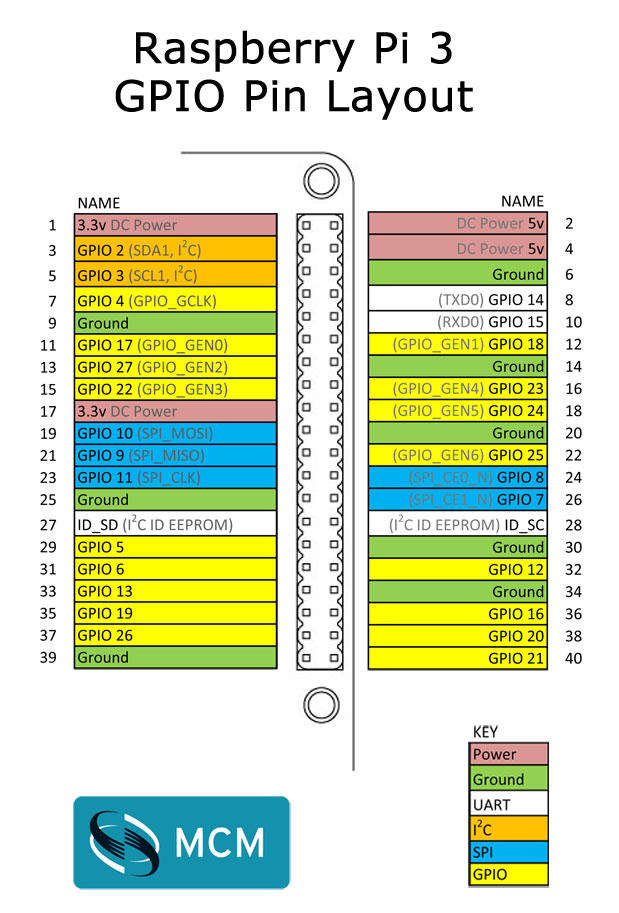

# Pinsight Client


### TODO
**High priority**
Can


Ben 
- The device buttons become unresponsive after X(?) hours

Danilo
- Save image offline (to test)
- Add developer dashboard (internet functionality, latest time updated...)
- Fix orientation of images
- Dialogue reset cycle must be different from dialogue update 
- LED for internet functionality
- Shut the LEDs when answers disappear after timeout, light them up together when answers pop back 

**Low priority**
- Idle state

### GPIO library

For the GPIO connection we're using the [onoff](https://github.com/fivdi/onoff) library.

**GPIO pins**

The GPIO pins are currently set as GPIO 3 (physical pin 5) and GPIO 4 (physical pin 7) corresponding to this image



Changing GPIO pins to GPIO 5 (physical pin 29) and GPIO 6 (physical pin 31), to be tested. 
LEDS use GPIO pins 13 (physical pin 33) and GPIO 19 (physical pin 35), to be tested. 

### Raspberry Pi Setup

Setup progress tracking:
https://docs.google.com/spreadsheets/d/1XBJJnqxrNuxTXOvi9kQJrgimipIlFKaPtse9c9HC5UU/edit?usp=sharing


Install RASPBIAN JESSIE WITH PIXEL following the [instructions on the Raspberry Pi site](https://www.raspberrypi.org/downloads/raspbian/) or use Noobs (https://www.raspberrypi.org/downloads/noobs/)
Follow the guide here: 

Make sure to connect the RPi to a 5V~2A power supply.

### Connect to the WIFI
Network: PhyCompOut
Pw: UCLICicriPC15


### Enable SSH

Run  ```sudo raspi-config``` go to Interfacing Option > Enable SSH

change ssh password to be ```pinsight```:
```
sudo -i
passwd pi
```

Use another computer and connect to PhyCompOut network
ssh pi@xxx.xxx.xxx.xxx (ip)
pw: pinsight

### TFT Screen (note that this will make the pi not working with your large screen, make sure to set up SSH before doing so)

You need to set the resolution of the LCD manually, or else the LCD screen will not work.

- Turn on the "backlight" switch then connect the LCD to your Pi
- Append the following lines to the config.txt file which is located at `/boot/config.txt`

```
sudo nano /boot/config.txt
```

5 inch display
```
max_usb_current=1
hdmi_group=2
hdmi_mode=87
hdmi_cvt=800 480 60 0 0 0
display_rotate=1
disable_touchscreen=1
hdmi_drive=1
```

7 inch display, the same as above besides:
```
hdmi_cvt 1024 600 60 6 0 0 0
```

(This is case and space sensitive!)

More info [here](http://www.waveshare.com/wiki/7inch_HDMI_LCD_%28B%29)


### Install Node

Node should be installed for ARM processor (https://node-arm.herokuapp.com/)
```
sudo apt-get update
sudo apt-get dist-upgrade
wget http://node-arm.herokuapp.com/node_latest_armhf.deb
sudo dpkg -i node_latest_armhf.deb
```
if encounter problem, remove nodejs legacy and install again
```
sudo apt-get remove nodejs-legacy
sudo dpkg -i node_latest_armhf.deb
```

#### Make sure NPM bins are executable globally
- Make a directory for global installations: 
```
mkdir ~/.npm-global
```
- Configure npm to use the new directory path ```
npm config set prefix '~/.npm-global'
```

## Open or create a ~/.profile file
```
sudo nano ~/.profile
```
and add this line:
```
export PATH=~/.npm-global/bin:$PATH
```

### Install mongojs and mongodb
```
npm install mongojs
sudo apt-get install mongodb-server
```

### Install Git

```bash
sudo apt-get install git
```

### Running the app

Go to Desktop, and run ```git clone https://bitbucket.org/ddicuia/pinsight.git``` to clone the repo


#### Install dependencies
Go into directory ``` pinsight/code/client ```
​```bash
sudo npm install
```

### Set device ID 
Edit the .env file at the root of the folder to set the device ID
​```bash
nano .env
```
add or change this line:
```
DEVICE_ID=<deviceid>
```

### Run server

The app runs on its own Node.js server to start the app run the following command and point your browser to [http://localhost:9000](http://localhost:9000)

​```bash
node index.js

sudo service mongodb start (start mongo server at start up)
```

###Setup soft shutdown
A save shutdown is executed via an external shut down button.

- Add python shutdown script to rc.local, which gets executed when RPi boots.
```
sudo nano /etc/rc.local

```
add the following right at the beginning of the file (before #Print IP address):

```
sudo python /home/pi/Desktop/pinsight-client/shutdown_pi.py

```
The soft shutdown button is set as GPIO 20 (physical pin 38). Please see image below.


#### Run browser in full mode at startup

Edit the contents of LXDE session autostart

​```
sudo nano ~/.config/lxsession/LXDE-pi/autostart
```

And add the following code:

​```bash
@lxpanel --profile LXDE
@pcmanfm --desktop --profile LXDE
@xscreensaver -no-splash
@/usr/bin/chromium-browser -incognito --kiosk --disabled --disable-infobars --disable-session-crashed-bubble --disable-restore-session-state http://localhost:9000
@unclutter -idle 0.1 -root
```

To make the mouse cursor disappear, one additional package needs to be installed
```
sudo apt-get install x11-xserver-utils unclutter
```

### Prevent the device to sleep

```
sudo nano /etc/lightdm/lightdm.conf
```

look for:
[SeatDefault] 
(pay attention to the [] enclosing SeatDefault)
and insert this line:
```xserver-command=X -s 0 -dpms``` 

### Command the Pi from your PC
1. Install VNC viewer on your pc
2. On the Pi `sudo apt-get install x11vnc`
3. On the Pi run `x11vnc`
4. Enter Pi IP address on your PC VNC viewer


#### Run server on startup 

1. install node process manager PM2 `sudo npm install -g pm2`
2. cd into the app directory
3. start the process `pm2 start index.js`
4. save the process `pm2 save`
5. Start pm2 at startup  `pm2 startup` This will detect init system, generate and configure pm2 
(the system will ask you to run it as root, so I just execute the suggested command from the system)
6. reboot `sudo reboot`

To check the application is running at startup use `pm2 list`. It should show that the "index" process is runni
###install tool to use keyboard via ssh to interact with browser
```
sudo apt-get install xdotool
export DISPLAY=:0.0
xdotool key "ctrl+r"
```

### Building the app (only for development)

The app uses React to visualize the data from the server.

install webpack
```
sudo npm install -g webpack
```

To build the app:

```bash
webpack -p
```

To continuosly build the app in development mode:

```bash
webpack --watch
```


### database sync diagram

```flow

st=>start: Start
e=>end
op1=>operation: Start mongodb
op1b=>operation: push responses to firebase
op2=>operation: every X seconds 
check connection
c1=>condition: connected?
c3=>condition: needs content update?
op3=>operation: get data from firebase
op4=>operation: start cycle dialogues
op5=>operation: update content on mongodb


st->op1->op2->c1
c1(yes)->op1b->c3
c1(no)->op2
c3(yes)->op3->op4->op5
```